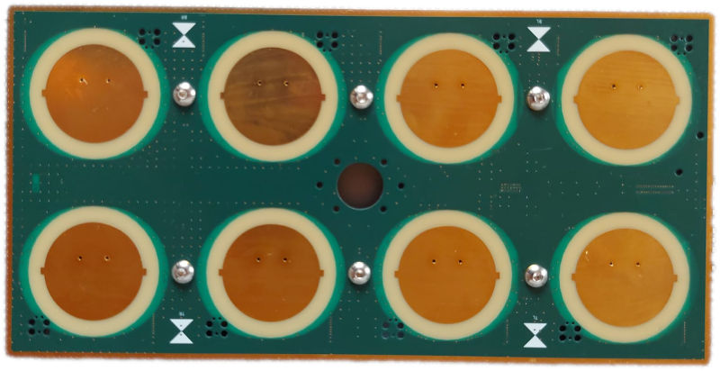
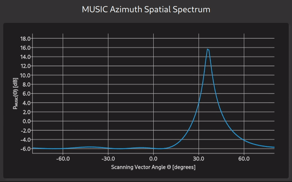
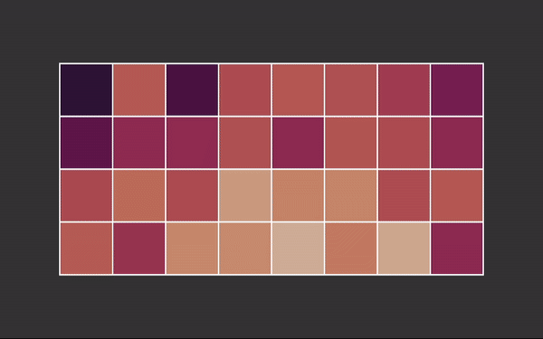

# ESPARGOS Python Client Library + Demos


*pyespargos* is the Python library for working with the [ESPARGOS](https://espargos.net/) WiFi channel sounder.
ESPARGOS is a real-time-capable, phase-synchronous 2 &times; 4 WiFi antenna array built from Espressif ESP32 chips that facilitates the development and deployment of WiFi sensing applications.

The library supports combining multiple ESPARGOS arrays into larger antenna arrays, various CSI preamble formats (L-LTF, HT20, HT40), and provides a flexible calibration system for multi-board setups.

## Different Hardware Revisions
<table>
	<tr>
		<th>Your ESPARGOS looks like this:</th>
		<th>Your ESPARGOS looks like this:</th>
	</tr>
	<tr>
		<td></td>
		<td></td>
	</tr>
	<tr>
		<td>&rarr; You have the current ESPARGOS, please use the <code>main</code> branch of this repository.</td>
		<td>&rarr; You have the older prototype generation of ESPARGOS, please use the <code>legacy-prototype</code> branch of this repository. This hardware revision is no longer supported.</td>
	</tr>
</table>

## Demo Applications
<table style="max-width: 800px;">
	<tr>
		<th style="text-align: center;">MUSIC Spatial Spectrum</th>
		<th style="text-align: center;">Receive Signal Phase by Antenna</th>
	</tr>
	<tr>
		<td style="text-align: center;"></td>
		<td style="text-align: center;"></td>
	</tr>
	<tr>
		<th style="text-align: center;">Instantaneous CSI: Frequency Domain</th>
		<th style="text-align: center;">Instantaneous CSI: Time Domain</th>
	</tr>
	<tr>
		<td style="text-align: center;"></td>
		<td style="text-align: center;"></td>
	</tr>
	<tr>
		<th style="text-align: center;">Phases over Time</th>
		<th style="text-align: center;">Combined 8 &times; 4 ESPARGOS Array</th>
	</tr>
	<tr>
		<td style="text-align: center;"></td>
		<td style="text-align: center;"></td>
	</tr>
</table>

*pyespargos* comes with a selection of demo applications for testing ESPARGOS.
All demos are built on a common application framework (`demos/common`) that provides:
* A consistent command-line interface and YAML configuration support
* A graphical pool management drawer for connecting to ESPARGOS devices
* Selectable preamble formats (L-LTF, HT20, HT40)
* Configurable CSI backlog settings

The following demos are provided in the `demos` folder of this repository:

| Demo | Description |
|------|-------------|
| `music-spectrum` | Use the [MUSIC algorithm](https://en.wikipedia.org/wiki/MUSIC_(algorithm)) to display a spatial (angular) spectrum. Demonstrates angle of arrival (AoA) estimation. |
| `phases-over-space` | Show the average received phase for each ESPARGOS antenna. |
| `instantaneous-csi` | Plot the current frequency-domain or time-domain transfer function of the measured channel. |
| `phases-over-time` | Plot the average received phase for every antenna over time. |
| `tdoas-over-time` | Visualize time difference of arrival (TDOA) measurements over time. |
| `azimuth-delay` | Display a 2D azimuth-delay diagram using beamspace processing. Requires shaders to be compiled first (see ``demos/azimuth-delay/README.md`). |
| `polarization` | Visualize WiFi signal polarization using constellation diagrams and polarization ellipses. |
| `speedtest` | Measure CSI packet throughput from ESPARGOS. |
| `combined-array` | Combine multiple ESPARGOS arrays into one large antenna array and visualize the average received phase for each antenna. Requires multiple ESPARGOS arrays. |
| `combined-array-calibration` | Tool for calibrating combined multi-board antenna arrays. Visualizes and exports calibration data. |
| `camera` | Overlay WiFi spatial spectrum on a live camera feed. Requires shaders to be compiled first (see `demos/camera/README.md`). |
| `radiation-pattern-3d` | Interactive 3D radiation pattern visualization. Requires additional packages (see [`demos/radiation-pattern-3d/README.md`](demos/radiation-pattern-3d/README.md)). |

Most demos support both single ESPARGOS arrays and combined multi-board setups via command-line arguments or YAML configuration files.

## Installation

*pyespargos* requires **Python 3.11 or newer**. Follow the instructions for your operating system below.

---

###  Linux

<details>
<summary><b>Click to expand Linux instructions</b></summary>

#### 1. Install Python

Most Linux distributions ship with Python pre-installed. Verify by running:

```bash
python3 --version
```

If Python is not installed or the version is too old, install it using your package manager:

```bash
# Debian / Ubuntu
sudo apt update && sudo apt install python3 python3-venv python3-pip

# Fedora
sudo dnf install python3 python3-pip

# Arch Linux
sudo pacman -S python python-pip
```

#### 2. Clone the repository

```bash
git clone https://github.com/ESPARGOS/pyespargos.git
```

#### 3. Create and activate a virtual environment

```bash
python3 -m venv ~/pyespargos-venv
source ~/pyespargos-venv/bin/activate
```

> **Note:** You need to run `source ~/pyespargos-venv/bin/activate` every time you open a new terminal before using *pyespargos*.

#### 4. Install pyespargos

Choose **one** of the following options:

- **Option A** &ndash; Standard install:
  ```bash
  cd pyespargos
  pip install .
  ```

- **Option B** &ndash; Editable install (for development, changes to the source take effect immediately):
  ```bash
  cd pyespargos
  pip install -e .
  ```

#### 5. Install demo dependencies (optional)

If you want to run the demo applications:

```bash
pip install pyqt6 pyqt6-charts pyyaml matplotlib
```

</details>

---

###  Windows
*(not recommended)*

<details>
<summary><b>Click to expand Windows instructions</b></summary>

#### 1. Install Python

If you don't have Python installed yet:

1. Go to [python.org/downloads](https://www.python.org/downloads/) and download the latest Python installer.
2. Run the installer. **Important: Check the box "Add python.exe to PATH"** at the bottom of the first installer screen before clicking "Install Now".
3. After installation, open a new **Command Prompt** (not **PowerShell**) window and verify:

```cmd
python --version
```

> **Tip:** You can also install Python from the Microsoft Store by searching for "Python".

#### 2. Clone the repository

```cmd
git clone https://github.com/ESPARGOS/pyespargos.git
```

#### 3. Create and activate a virtual environment

Open a **Command Prompt** window (**not** PowerShell):

```cmd
python -m venv %USERPROFILE%\pyespargos-venv
%USERPROFILE%\pyespargos-venv\Scripts\activate
```

> **Note:** You need to activate the virtual environment every time you open a new terminal before using *pyespargos*.

#### 4. Install pyespargos

Choose **one** of the following options:

- **Option A** &ndash; Standard install:
  ```cmd
  cd pyespargos
  pip install .
  ```

- **Option B** &ndash; Editable install (for development, changes to the source take effect immediately):
  ```cmd
  cd pyespargos
  pip install -e .
  ```

#### 5. Install demo dependencies (optional)

If you want to run the demo applications:

```cmd
pip install pyqt6 pyqt6-charts pyyaml matplotlib
```

</details>

---

###  macOS
*(not recommended)*

<details>
<summary><b>Click to expand macOS instructions</b></summary>

#### 1. Install Python

The recommended way to install Python on macOS is via [Homebrew](https://brew.sh/):

```bash
# Install Homebrew (if not already installed)
/bin/bash -c "$(curl -fsSL https://raw.githubusercontent.com/Homebrew/install/HEAD/install.sh)"

# Install Python
brew install python
```

> **Important:** After installing Python with Homebrew, **close and re-open your terminal** so that the Homebrew-installed Python is used instead of the older macOS system Python.

Verify the installation:

```bash
python3 --version
```

> **Alternative:** You can also download the installer from [python.org/downloads](https://www.python.org/downloads/).

#### 2. Clone the repository

```bash
git clone https://github.com/ESPARGOS/pyespargos.git
```

#### 3. Create and activate a virtual environment

```bash
python3 -m venv ~/pyespargos-venv
source ~/pyespargos-venv/bin/activate
```

> **Note:** You need to run `source ~/pyespargos-venv/bin/activate` every time you open a new terminal before using *pyespargos*.

#### 4. Install pyespargos

Choose **one** of the following options:

- **Option A** &ndash; Standard install:
  ```bash
  cd pyespargos
  pip install .
  ```

- **Option B** &ndash; Editable install (for development, changes to the source take effect immediately):
  ```bash
  cd pyespargos
  pip install -e .
  ```

#### 5. Install demo dependencies (optional)

If you want to run the demo applications:

```bash
pip install pyqt6 pyqt6-charts pyyaml matplotlib
```

</details>

---

### Running a Demo

After installing *pyespargos* and the demo dependencies (steps above), you can run a demo.
Make sure the virtual environment is activated, then run the following from the *pyespargos* directory.

For example, to run the **Instantaneous CSI** demo with an ESPARGOS controller at `192.168.1.2`:

**Linux / macOS:**
```bash
./demos/instantaneous-csi/instantaneous-csi.py 192.168.1.2
```

**Windows (Command Prompt):**
```cmd
python demos\instantaneous-csi\instantaneous-csi.py 192.168.1.2
```

If you have multiple ESPARGOS boards, pass their addresses separated by commas:

```
python demos/instantaneous-csi/instantaneous-csi.py 192.168.1.2,192.168.1.3
```

Other demos may ask for different command line arguments.
Run any demo with `--help` to see the available options.

---

### Custom Applications: Quick Start

To create your own ESPARGOS-based application, you have two options:
* Use the Python + PyQt6 + QML framework used by the other demos. This is the fastest way to get up and running, just start by modifying an existing demo.
* Write your application from scratch using only the `pyespargos` library

#### Applications from Scratch

After installation, import the `espargos` package in your Python application. Use this minimal sample code to get started:

```python
#!/usr/bin/env python

import espargos
import time

pool = espargos.Pool([espargos.Board("192.168.1.2")])
pool.start()
pool.calibrate(duration = 2)
backlog = espargos.CSIBacklog(pool, size = 20)
backlog.start()

# Wait for a while to collect some WiFi packets to the backlog...
time.sleep(4)

# Get CSI data from the backlog (L-LTF format)
csi_lltf = backlog.get_lltf()
print("Received CSI (L-LTF): ", csi_lltf)

backlog.stop()
pool.stop()
```

## Basics

### WiFi
* ESPARGOS uses the L-LTF and/or HT-LTF fields of 802.11g/n/ax frames to extract channel state information (CSI).
* ESPARGOS is totally passive, it only acts as a receiver in promiscuous mode. It provides CSI for any WiFi frames it receives.
* To receive frames, the transmitter and ESPARGOS must use the same WiFi channel.
* 802.11n supports channel bandwidths of 20MHz and 40MHz. The ESPARGOS hardware and firmware support both bandwidth configurations.
* *pyespargos* currently supports three preamble formats for CSI extraction:
  - **L-LTF**: Legacy Long Training Field, available in all 802.11g/n frames (52 subcarriers)
  - **HT20**: High Throughput 20MHz, available in 802.11n frames with 20MHz bandwidth (56 subcarriers)
  - **HT40**: High Throughput 40MHz, available in 802.11n frames with 40MHz channel bonding (114 subcarriers)

### Communication between pyespargos and ESPARGOS
* ESPARGOS provides an HTTP / WebSocket / UDP API.
* Control commands (configuration, calibration, etc.) are issued via HTTP.
* CSI data is streamed in binary format. Two transports are supported:
  - **UDP** (default): Lower latency and higher throughput. The library automatically sends periodic keepalive packets to maintain firewall pinholes on platforms like Windows.
  - **WebSocket**: More widely compatible fallback, but slightly higher latency and overhead.
* By default, *pyespargos* tries UDP first and falls back to WebSocket if UDP fails.

### The Backlog
* The L-LTF and HT-LTF fields used for channel estimation are really short compared to the total length of the WiFi frame.
* This results in really noisy CSI estimates.
* Therefore, it is a good idea to average CSI over multiple WiFi packets.
* To this end, *pyespargos* offers a *backlog* functionality, where CSI from the last N packets is cached. The backlog is implemented as a ringbuffer.
* The `CSIBacklog` class supports configurable fields (lltf, ht20, ht40, rssi, timestamp, mac) and optional MAC address filtering.
* In some applications, you may want use the CSI interpolation helpers in `espargos/util.py`.

### CSI Clustering
* When receiving CSI from multiple antennas (potentially across multiple ESPARGOS boards), data from the same WiFi packet needs to be grouped together.
* The `CSICluster` class handles this clustering automatically, ensuring that CSI from all antennas is properly aligned.
* Callbacks can be registered with the `Pool` to receive complete clusters when all (or a subset of) antennas have reported.
* If you are using a backlog, then this aspect is abstracted away for you.

### Calibration
* ESPARGOS is based on phase-synchronized ESP32 SoCs. Phase synchronization is achieved in two steps:

	- All ESP32 chips are clocked from the same 40MHz reference clock, which makes them frequency-synchronous.
	- To correct for PLL phase ambiguity, WiFi PPDUs are distributed to all ESP32 chips over a known channel (microstrip traces of known length on the PCB).

* Now we know the initial phase of the local oscillator (LO) signal on every ESP32.
* With *pyespargos*, this calibration can be performed with just one command: `pool.calibrate()`
* In our observations, this initial phase offset between antennas remains relatively static over time, so one calibration of ESPARGOS should be sufficient.
* Additionally, we can obtain very precise packet reception timestamps, which provides time synchronization.

### Multi-Board / Combined Arrays
* *pyespargos* supports combining multiple ESPARGOS boards into a single large antenna array.
* The `CSICalibration` class handles phase calibration across boards, including compensation for different cable lengths and velocity factors used to distribute the synchronization signal.
* Board-specific parameters (PCB trace lengths, etc.) are automatically handled based on hardware revision detection.
* The `combined-array-calibration` demo can be used to generate and export calibration data for multi-board setups.

## Additional Non-Public Demo Applications
* `dataset-recorder`: Application to record ESPARGOS datasets for publication on [https://espargos.net/datasets/](https://espargos.net/datasets/). Please contact me to get access.
* `realtime-localization`: Real-time Localization Demo: Channel Charting vs. Triangulation vs. Supervised Training. Requires multiple ESPARGOS. Please contact me to get access.
<p>
	
</p>

## License
`pyespargos` is licensed under the GNU Lesser General Public License version 3 (LGPLv3), see `LICENSE` for details.