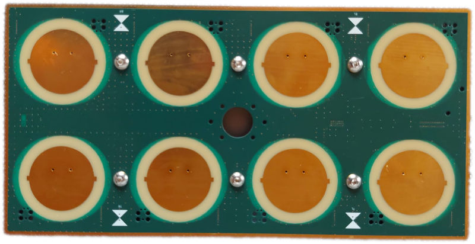
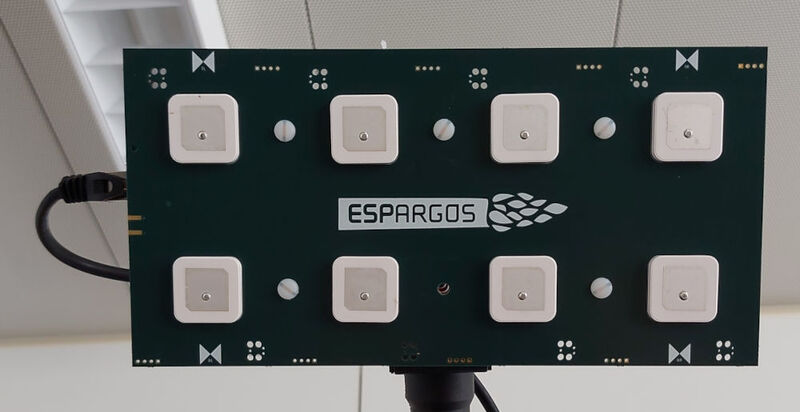
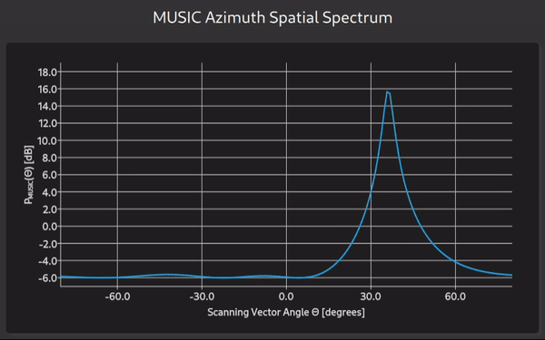
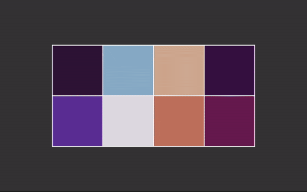
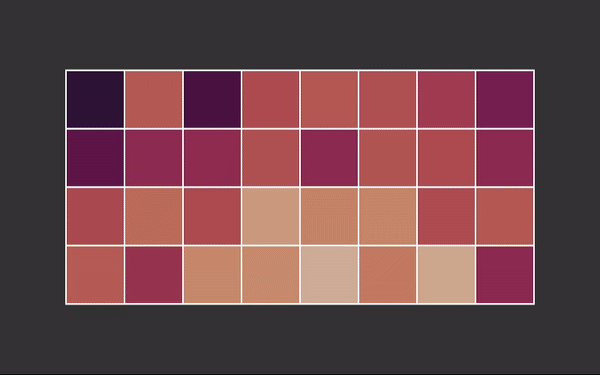
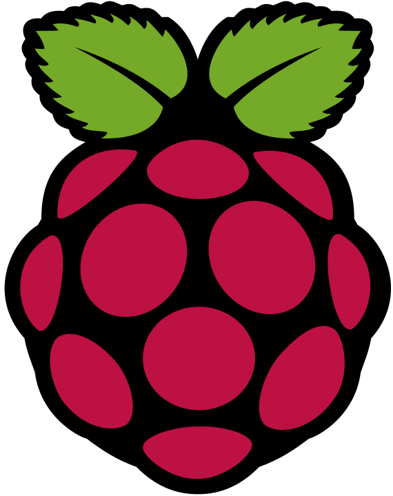

# ESPARGOS Python Client Library + Demos


*pyespargos* is the Python library for working with the [ESPARGOS](https://espargos.net/) WiFi channel sounder.
ESPARGOS is a real-time-capable, phase-synchronous 2 &times; 4 WiFi antenna array built from Espressif ESP32 chips that facilitates the development and deployment of WiFi sensing applications.

The library supports combining multiple ESPARGOS arrays into larger antenna arrays, various CSI preamble formats (L-LTF, HT20, HT40), and provides a flexible calibration system for multi-board setups.

## Different Hardware Revisions
<table>
	<tr>
		<th width="50%">Your ESPARGOS looks like this:</th>
		<th width="50%">Your ESPARGOS looks like this:</th>
	</tr>
	<tr>
		<td width="50%"></td>
		<td width="50%"></td>
	</tr>
	<tr>
		<td width="50%">&rarr; You have the current ESPARGOS, please use the <code>main</code> branch of this repository.</td>
		<td width="50%">&rarr; You have the older prototype generation of ESPARGOS, please use the <code>legacy-prototype</code> branch of this repository. This hardware revision is no longer supported.</td>
	</tr>
</table>

## Demo Applications
<table style="max-width: 800px;">
	<tr>
		<th style="text-align: center;">MUSIC Spatial Spectrum</th>
		<th style="text-align: center;">Receive Signal Phase by Antenna</th>
	</tr>
	<tr>
		<td style="text-align: center;"></td>
		<td style="text-align: center;"></td>
	</tr>
	<tr>
		<th style="text-align: center;">Instantaneous CSI: Frequency Domain</th>
		<th style="text-align: center;">Instantaneous CSI: Time Domain</th>
	</tr>
	<tr>
		<td style="text-align: center;"></td>
		<td style="text-align: center;"></td>
	</tr>
	<tr>
		<th style="text-align: center;">Phases over Time</th>
		<th style="text-align: center;">Combined 8 &times; 4 ESPARGOS Array</th>
	</tr>
	<tr>
		<td style="text-align: center;"></td>
		<td style="text-align: center;"></td>
	</tr>
</table>

*pyespargos* comes with a selection of demo applications for testing ESPARGOS.
All demos are built on a common application framework (`demos/common`) that provides:
* A consistent command-line interface and YAML configuration support
* A graphical pool management drawer for connecting to ESPARGOS devices
* Selectable preamble formats (L-LTF, HT20, HT40)
* Configurable CSI backlog settings

The following demos are provided in the `demos` folder of this repository:

| Demo | Description |
|------|-------------|
| `music-spectrum` | Use the [MUSIC algorithm](https://en.wikipedia.org/wiki/MUSIC_(algorithm)) to display a spatial (angular) spectrum. Demonstrates angle of arrival (AoA) estimation. |
| `phases-over-space` | Show the average received phase for each ESPARGOS antenna. |
| `instantaneous-csi` | Plot the current frequency-domain or time-domain transfer function of the measured channel. |
| `phases-over-time` | Plot the average received phase for every antenna over time. |
| `tdoas-over-time` | Visualize time difference of arrival (TDOA) measurements over time. |
| `azimuth-delay` | Display a 2D azimuth-delay diagram using beamspace processing. Requires shaders to be compiled first (see ``demos/azimuth-delay/README.md`). |
| `polarization` | Visualize WiFi signal polarization using constellation diagrams and polarization ellipses. |
| `speedtest` | Measure CSI packet throughput from ESPARGOS. |
| `combined-array` | Combine multiple ESPARGOS arrays into one large antenna array and visualize the average received phase for each antenna. Requires multiple ESPARGOS arrays. |
| `combined-array-calibration` | Tool for calibrating combined multi-board antenna arrays. Visualizes and exports calibration data. |
| `camera` | Overlay WiFi spatial spectrum on a live camera feed. Requires shaders to be compiled first (see `demos/camera/README.md`). |
| `radiation-pattern-3d` | Interactive 3D radiation pattern visualization. Requires additional packages (see [`demos/radiation-pattern-3d/README.md`](demos/radiation-pattern-3d/README.md)). |

Most demos support both single ESPARGOS arrays and combined multi-board setups via command-line arguments or YAML configuration files.

## Installation

*pyespargos* requires **Python 3.11 or newer**. Follow the instructions for your operating system below.

---

###  Linux /  Raspberry Pi

<details>
<summary><b>Click to expand Linux instructions</b></summary>

#### 1. Install Python

Most Linux distributions ship with Python pre-installed. Verify by running:

```bash
python3 --version
```

If Python is not installed or the version is too old, install it using your package manager:

```bash
# Debian / Ubuntu / Raspberry Pi OS (Raspbian)
sudo apt update && sudo apt install python3 python3-venv python3-pip

# Fedora
sudo dnf install python3 python3-pip

# Arch Linux
sudo pacman -S python python-pip
```

#### 2. Clone the repository

```bash
git clone https://github.com/ESPARGOS/pyespargos.git
```

#### 3. Create and activate a virtual environment

```bash
cd pyespargos
python3 -m venv .venv
source .venv/bin/activate
```

> **Note:** You need to run `source .venv/bin/activate` (from the `pyespargos` directory) every time you open a new terminal before using *pyespargos*.

#### 4. Install pyespargos

```bash
pip install -e .
```

#### 5. Install demo dependencies (optional)

If you want to run the demo applications:

```bash
pip install pyqt6 pyqt6-charts pyyaml matplotlib
```

If you want to run demos such as `camera` and `azimuth-delay`, you will also need Qt Shader Baker (`qsb`):

```bash
# Debian / Ubuntu / Raspberry Pi OS (Raspbian)
sudo apt install qt6-shader-baker

# Fedora
sudo dnf install qt6-qtshadertools

# Arch Linux
sudo pacman -S qt6-shadertools
```

> **Note:** The `compile_shader.sh` scripts currently expect `qsb` at `/usr/lib/qt6/bin/qsb`. If your distribution installs it elsewhere, update the script accordingly.

</details>

---

###  Windows
*(not recommended)*

<details>
<summary><b>Click to expand Windows instructions</b></summary>

#### 1. Install Python

If you don't have Python installed yet:

1. Go to [python.org/downloads](https://www.python.org/downloads/) and download the latest Python installer.
2. Run the installer. **Important: Check the box "Add python.exe to PATH"** at the bottom of the first installer screen before clicking "Install Now".
3. After installation, open a new **Command Prompt** (not **PowerShell**) window and verify:

```cmd
python --version
```

> **Tip:** You can also install Python from the Microsoft Store by searching for "Python".

#### 2. Clone the repository

```cmd
git clone https://github.com/ESPARGOS/pyespargos.git
```

#### 3. Create and activate a virtual environment

Open a **Command Prompt** window (**not** PowerShell):

```cmd
cd pyespargos
python -m venv .venv
.venv\Scripts\activate
```

> **Note:** You need to activate the virtual environment every time you open a new terminal before using *pyespargos*.

#### 4. Install pyespargos

```cmd
pip install -e .
```

#### 5. Install demo dependencies (optional)

If you want to run the demo applications:

```cmd
pip install pyqt6 pyqt6-charts pyyaml matplotlib
```

If you want to run demos such as `camera` and `azimuth-delay`, you will also need Qt 6 so that `qsb.exe` (Qt Shader Baker) is available. The simplest option is to use the Qt Online Installer and install a desktop Qt 6 kit.

> **Note:** The shader batch scripts currently default to `C:\Qt\6.10.2\mingw_64\bin\qsb.exe`. If your Qt installation is in a different location, either update the `QSB` path in the `.bat` scripts or add the Qt `bin` directory to `PATH`.

</details>

---

###  macOS
*(not recommended)*

<details>
<summary><b>Click to expand macOS instructions</b></summary>

#### 1. Install Python

The recommended way to install Python on macOS is via [Homebrew](https://brew.sh/):

```bash
# Install Homebrew (if not already installed)
/bin/bash -c "$(curl -fsSL https://raw.githubusercontent.com/Homebrew/install/HEAD/install.sh)"

# Install Python
brew install python
```

> **Important:** After installing Python with Homebrew, **close and re-open your terminal** so that the Homebrew-installed Python is used instead of the older macOS system Python.

Verify the installation:

```bash
python3 --version
```

> **Alternative:** You can also download the installer from [python.org/downloads](https://www.python.org/downloads/).

#### 2. Clone the repository

```bash
git clone https://github.com/ESPARGOS/pyespargos.git
```

#### 3. Create and activate a virtual environment

```bash
cd pyespargos
python3 -m venv .venv
source .venv/bin/activate
```

> **Note:** You need to run `source .venv/bin/activate` (from the `pyespargos` directory) every time you open a new terminal before using *pyespargos*.

#### 4. Install pyespargos

```bash
pip install -e .
```

#### 5. Install demo dependencies (optional)

If you want to run the demo applications:

```bash
pip install pyqt6 pyqt6-charts pyyaml matplotlib
```

If you want to run demos such as `camera` and `azimuth-delay`, you will also need Qt Shader Baker (`qsb`). One option is:

```bash
brew install qt
```

Then verify that `qsb` is available:

```bash
qsb --version
```

> **Note:** If `qsb` is not on your `PATH`, use the full path from your Qt installation when running `compile_shader.sh`.

</details>

---

### Running a Demo

After installing *pyespargos* and the demo dependencies (steps above), you can run a demo.
Make sure the virtual environment is activated, then run the following from the *pyespargos* directory.

For example, to run the **Instantaneous CSI** demo with an ESPARGOS controller at `192.168.1.2`:

**Linux / macOS:**
```bash
./demos/instantaneous-csi/instantaneous-csi.py 192.168.1.2
```

**Windows (Command Prompt):**
```cmd
python demos\instantaneous-csi\instantaneous-csi.py 192.168.1.2
```

If you have multiple ESPARGOS boards, pass their addresses separated by commas:

```
python demos/instantaneous-csi/instantaneous-csi.py 192.168.1.2,192.168.1.3
```

Other demos may ask for different command line arguments.
Run any demo with `--help` to see the available options.


### Connecting over USB / UART tunnelling

ESPARGOS can also tunnel its control and CSI traffic over the USB serial connection.
This is useful if you do not have Ethernet available, or if you want to configure ESPARGOS network settings through USB before putting it on a network.

There are two ways to use the USB UART connection:

#### Access the web interface over USB

The `tools/espargos-uart-router.py` helper exposes an ESPARGOS USB serial connection as a local HTTP / WebSocket endpoint.
After connecting ESPARGOS to your computer via USB-C, run:

```bash
python tools/espargos-uart-router.py uart:/dev/ttyUSB0
```

Replace `/dev/ttyUSB0` with the serial device used by ESPARGOS on your computer.
Typical examples are:

* Linux: `uart:/dev/ttyUSB0` or `uart:/dev/ttyACM0`
* macOS: `uart:/dev/tty.usbserial-...`
* Windows: `uart:COM3`

By default, the router listens on `127.0.0.1:8400`.
Open [http://127.0.0.1:8400](http://127.0.0.1:8400) in your browser to use the ESPARGOS web interface through USB.

> **Note:** Firmware updates are not supported through the UART router. Use Ethernet for firmware updates.

#### Use USB directly from pyespargos

All pyespargos demos and APIs that accept an ESPARGOS host can also use a UART host specifier instead of an IP address or hostname.
Use the format `uart:<serial-device>`.

For example, to run the **Instantaneous CSI** demo over USB on Linux:

```bash
./demos/instantaneous-csi/instantaneous-csi.py uart:/dev/ttyUSB0
```

On Windows:

```cmd
python demos\instantaneous-csi\instantaneous-csi.py uart:COM3
```

In your own Python code, pass the same host string to `espargos.Board`:

```python
board = espargos.Board("uart:/dev/ttyUSB0")
```

If you need to override the default UART baud rate, append it after `@`, for example `uart:/dev/ttyUSB0@3000000`.

> **Note:** The UART router and pyespargos direct UART access both need exclusive access to the serial device. Do not run the router while a pyespargos demo or application is connected directly to the same `uart:...` device.

---

### Custom Applications: Quick Start

To create your own ESPARGOS-based application, you have two options:
* Use the Python + PyQt6 + QML framework used by the other demos. This is the fastest way to get up and running, just start by modifying an existing demo.
* Write your application from scratch using only the `pyespargos` library

#### Applications from Scratch

After installation, import the `espargos` package in your Python application. Use this minimal sample code to get started:

```python
#!/usr/bin/env python

import espargos
import time

pool = espargos.Pool([espargos.Board("192.168.1.2")])
pool.start()
pool.calibrate(duration=2)

backlog = espargos.CSIBacklog(pool, fields=["lltf", "rssi"], size=20)
backlog.start()

try:
    # Wait a moment so the backlog can collect some WiFi packets.
    time.sleep(4)

    if backlog.nonempty():
        csi_lltf, rssi = backlog.get_multiple(("lltf", "rssi"))
        print("L-LTF backlog shape:", csi_lltf.shape)
        print("RSSI backlog:", rssi)
    else:
        print("No CSI data received yet.")
finally:
    backlog.stop()
    pool.stop()
```

## Basics

### WiFi
* ESPARGOS extracts channel state information (CSI) from WiFi training fields received by the sensor ESP32s.
* During normal CSI capture, ESPARGOS is passive: it receives packets in promiscuous mode and reports CSI for packets it can decode (the only exception to this is an experimental radar mode, to be documented).
* To receive over-the-air packets, the transmitter and ESPARGOS must use the same primary channel and compatible bandwidth settings.
* The current firmware and *pyespargos* support these CSI formats:
  - **L-LTF** (`lltf`): legacy long training field from 802.11g-style packets, represented as 53 subcarriers (`-26..26`, with DC reconstructed/interpolated when needed). In fact, even the newer HT/HE packets contain L-LTF fields. In a **force L-LTF** mode you can change the behavior of ESPARGOS to *always* extract the L-LTF CSI instead of the other training fields. The L-LTF CSI supports 12-bit I/Q encoding (instead of just 8-bit encoding like the other preamble formats), which makes this mode preferable for situations in which dynamic range is important.
  - **HT20** (`ht20`): 802.11n HT-LTF for 20 MHz packets, represented as 57 subcarriers (`-28..28`).
  - **HT40** (`ht40`): 802.11n HT-LTF for 40 MHz channel bonding, represented as 117 bins (`-58..58`, including the 3-bin gap between the bonded channels).
  - **HE20** (`he20`): 802.11ax HE-LTF for 20 MHz packets, represented as 245 bins (`-122..122`, with invalid/null tones around DC zeroed by *pyespargos*).
* 802.11b packets do not carry CSI. *pyespargos* can filter them out with `Exclude11bFilter`.
* CSI can be transported either as raw coefficients or in the firmware's compressed time-domain representation; *pyespargos* decodes both into complex NumPy arrays.

### Communication between pyespargos and ESPARGOS
* The controller exposes a small HTTP API for identification, configuration, RF switch control, calibration, gain settings, MAC filtering and radar/TX configuration.
* On Ethernet, *pyespargos* sends control commands via HTTP and can receive CSI through:
  - **UDP** (default): lower latency and higher throughput. *pyespargos* opens a local UDP socket, asks the controller to stream to it via `/csi_udp`, waits for a magic packet, and sends periodic keepalives to keep firewall/NAT state alive.
  - **WebSocket** (`/csi`): more compatible fallback, and the transport used by the web interface.
* Over USB, *pyespargos* accepts UART host specifiers such as `uart:/dev/ttyUSB0` or `uart:COM3`. Control RPCs and CSI streaming are then tunnelled over the serial link.
* `Board.start()` chooses transports automatically: network hosts try UDP first and fall back to WebSocket; UART hosts use the UART transport.
* Only one CSI stream transport can be active on a controller at a time. The UART router and direct *pyespargos* UART access also need exclusive access to the serial device.

### The Backlog
* Individual WiFi training fields are short, so single-packet CSI is often noisy. Many applications work on a recent window of packets instead of only the newest packet.
* `CSIBacklog` keeps the last N CSI clusters in a ringbuffer and lets application code read consistent snapshots with `get()` or `get_multiple()`.
* Backlog fields are configurable. Current fields include `lltf`, `ht20`, `ht40`, `he20`, `rssi`, `cfo`, `rfswitch_state`, `timestamp`, `host_timestamp`, `mac`, `radar_tx_timestamp` and `radar_tx_index`.
* CSI fields are stored as complex NumPy arrays with shape `(datapoints, boards, rows, antennas, subcarriers)`. Per-antenna metadata uses the same board/row/antenna layout.
* By default, `CSIBacklog` applies the pool calibration before storing CSI. Pass `calibrate=False` if you need raw, uncalibrated CSI.
* Backlog filters such as `MacFilter` and `Exclude11bFilter` can drop packets before they enter the ringbuffer.
* Utility functions in `espargos/util.py` provide common CSI post-processing helpers, including subcarrier frequency axes, gap interpolation, feed separation, time-domain transforms and AoA/ToA helpers.

### CSI Clustering
* Each sensor reports CSI separately. `Pool` groups those sensor reports into `CSICluster` objects that represent one WiFi packet across one or more ESPARGOS boards.
* Clustering uses packet metadata such as source/destination MAC addresses and sequence control, with separate handling for calibration packets and over-the-air packets.
* A cluster tracks which sensors have reported, so applications can wait for all antennas or provide a custom callback predicate for partial clusters.
* `CSICluster` exposes deserializers for `lltf`, `ht20`, `ht40` and `he20`, plus metadata such as RSSI, CFO, RF switch state, source MAC, primary/secondary channel, host timestamp and per-sensor hardware timestamps.
* The deserializers also apply format-specific corrections such as STO/CFO phase correction and HE20 null-tone handling.
* If you use `CSIBacklog`, clustering happens underneath it and you usually only interact with the backlog arrays.

### Calibration
* ESPARGOS uses a shared 40 MHz reference clock so the sensor ESP32s are frequency-synchronous.
* The remaining per-sensor LO phase ambiguity is estimated from calibration packets that are distributed over known PCB traces / reference paths.
* With *pyespargos*, calibration is usually performed with `pool.calibrate(duration=...)`. The resulting `CSICalibration` stores phase calibration values for L-LTF, HT20, HT40 and HE20, plus per-sensor clock offsets.
* If some formats are missing during calibration, *pyespargos* can derive compatible calibration values where possible, for example deriving L-LTF calibration from HT20 packets or deriving HE20 calibration from L-LTF timing/phase information.
* `CSICalibration` applies phase-only calibration to CSI and can compensate board-specific trace delays. For multi-board setups, it can also compensate external sync-cable lengths and velocity factors.
* Calibration is tied to the WiFi channel configuration used when it was collected. Recalibrate after changing primary/secondary channel settings or after changing the synchronization topology.

### Multi-Board / Combined Arrays
* *pyespargos* supports pools with one or more ESPARGOS boards. A multi-board `Pool` clusters packets across all boards and presents CSI in `(boards, rows, antennas, subcarriers)` layout.
* Board revisions are detected from the controller API, and board-specific calibration trace delays are applied automatically.
* For combined arrays, pass external sync-cable lengths / velocity factors when creating calibration data so phase offsets caused by the synchronization distribution are compensated.
* `refgen_boards` can be used when separate ESPARGOS controllers generate calibration packets but are not part of the receive array.
* Helpers in `espargos/util.py` can map board data into larger array layouts, and the `combined-array` / `combined-array-calibration` demos show typical workflows.

### Radar / controlled transmissions
* In addition to passive CSI capture, the current firmware exposes low-level radar/TX configuration through the controller API.
* `Board.set_radar_config()` / `Pool.set_radar_config()` configure per-antenna transmit activity, timing, MAC addresses, PHY mode/rate and TX power.
* Radar packets can carry TX metadata. `CSICluster` and `CSIBacklog` expose this through fields such as `radar_tx_timestamp` and `radar_tx_index`, which are useful when correcting CSI using known transmit timing.
* The `espargos.radar` helpers provide higher-level utilities for building radar pool configurations and correcting radar CSI phase using TX timestamps.
* This mode is *experimental* and the APIs are *unstable*.

## Additional Non-Public Demo Applications
* `dataset-recorder`: Application to record ESPARGOS datasets for publication on [https://espargos.net/datasets/](https://espargos.net/datasets/). Please contact me to get access.
* `realtime-localization`: Real-time Localization Demo: Channel Charting vs. Triangulation vs. Supervised Training. Requires multiple ESPARGOS. Please contact me to get access.
<p>
	
</p>

## License
`pyespargos` is licensed under the GNU Lesser General Public License version 3 (LGPLv3), see `LICENSE` for details.
