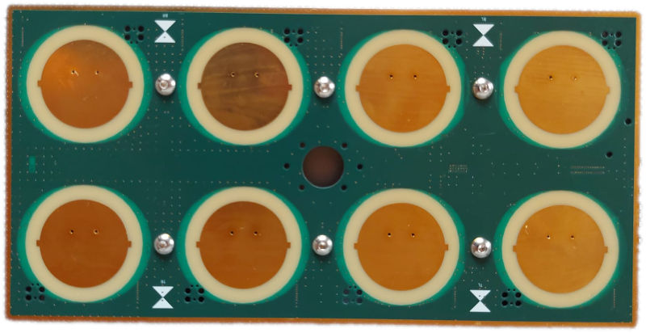
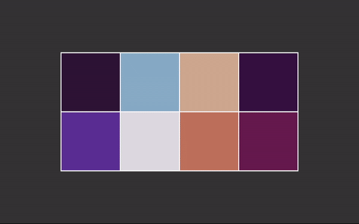
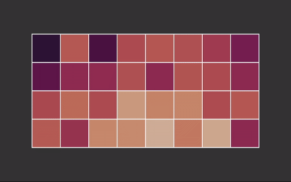

# ESPARGOS Python Client Library + Demos


*pyespargos* is the Python library for working with the [ESPARGOS](https://espargos.net/) WiFi channel sounder.
ESPARGOS is a real-time-capable, phase-synchronous 2 &times; 4 WiFi antenna array built from Espressif ESP32 chips that facilitates the development and deployment of WiFi sensing applications.

The library supports combining multiple ESPARGOS arrays into larger antenna arrays, various CSI preamble formats (L-LTF, HT20, HT40), and provides a flexible calibration system for multi-board setups.

## Different Hardware Revisions
<table>
	<tr>
		<th width="50%">Your ESPARGOS looks like this:</th>
		<th width="50%">Your ESPARGOS looks like this:</th>
	</tr>
	<tr>
		<td width="50%"></td>
		<td width="50%"></td>
	</tr>
	<tr>
		<td width="50%">&rarr; You have the current ESPARGOS, please use the <code>main</code> branch of this repository.</td>
		<td width="50%">&rarr; You have the older prototype generation of ESPARGOS, please use the <code>legacy-prototype</code> branch of this repository. This hardware revision is no longer supported.</td>
	</tr>
</table>

## Demo Applications
<table style="max-width: 800px;">
	<tr>
		<th style="text-align: center;">MUSIC Spatial Spectrum</th>
		<th style="text-align: center;">Receive Signal Phase by Antenna</th>
	</tr>
	<tr>
		<td style="text-align: center;"></td>
		<td style="text-align: center;"></td>
	</tr>
	<tr>
		<th style="text-align: center;">Instantaneous CSI: Frequency Domain</th>
		<th style="text-align: center;">Instantaneous CSI: Time Domain</th>
	</tr>
	<tr>
		<td style="text-align: center;"></td>
		<td style="text-align: center;"></td>
	</tr>
	<tr>
		<th style="text-align: center;">Phases over Time</th>
		<th style="text-align: center;">Combined 8 &times; 4 ESPARGOS Array</th>
	</tr>
	<tr>
		<td style="text-align: center;"></td>
		<td style="text-align: center;"></td>
	</tr>
</table>

*pyespargos* comes with a selection of demo applications for testing ESPARGOS.
Receive demos are built on a common application framework (`demos/common`) that provides:
* A consistent command-line interface and YAML configuration support
* A graphical pool management drawer for connecting to ESPARGOS devices
* Selectable preamble formats (L-LTF, HT20, HT40)
* Configurable CSI backlog settings

The following demos are provided in the `demos` folder of this repository:

| Demo | Description |
|------|-------------|
| `iq-transmit-beamforming` | Control up to four TX beams across a single or combined array, with waveform generation/upload, beamspace steering, RX/TX calibration and a reference monitor. See [usage](demos/iq-transmit-beamforming/README.md). |
| `iq-signal-analyzer` | Display synchronized raw IQ as power/phase waterfalls, I/Q traces, constellations, and spectra. Supports Interval, Accumulate, and Signal capture; see [usage](demos/iq-signal-analyzer/README.md). |
| `music-spectrum` | Use the [MUSIC algorithm](https://en.wikipedia.org/wiki/MUSIC_(algorithm)) to display a spatial (angular) spectrum. Demonstrates angle of arrival (AoA) estimation. |
| `phases-over-space` | Show the average received phase for each ESPARGOS antenna. |
| `instantaneous-csi` | Plot the current frequency-domain or time-domain transfer function of the measured channel. |
| `phases-over-time` | Plot the average received phase for every antenna over time. |
| `tdoas-over-time` | Visualize time difference of arrival (TDOA) measurements over time. |
| `azimuth-delay` | Display a 2D azimuth-delay diagram using beamspace processing. Ships with pre-compiled shaders; see [`demos/azimuth-delay/README.md`](demos/azimuth-delay/README.md) in case of shader issues. |
| `polarization` | Visualize WiFi signal polarization using constellation diagrams and polarization ellipses. |
| `speedtest` | Measure CSI packet throughput from ESPARGOS. |
| `combined-array` | Combine multiple ESPARGOS arrays into one large antenna array and visualize the average received phase for each antenna. Requires multiple ESPARGOS arrays. |
| `combined-array-calibration` | Tool for calibrating combined multi-board antenna arrays. Visualizes and exports calibration data. |
| `camera` | Overlay WiFi spatial spectrum on a live camera feed. Ships with pre-compiled shaders; see [`demos/camera/README.md`](demos/camera/README.md) in case of shader issues. |
| `radiation-pattern-3d` | Interactive 3D radiation pattern visualization. Requires additional packages (see [`demos/radiation-pattern-3d/README.md`](demos/radiation-pattern-3d/README.md)). |

Most demos support both single ESPARGOS arrays and combined multi-board setups via command-line arguments or YAML configuration files.

## Installation

*pyespargos* requires **Python 3.11 or newer**. Follow the instructions for your operating system below.

---

###  Linux /  Raspberry Pi

<details>
<summary><b>Click to expand Linux instructions</b></summary>

#### 1. Install Python

Most Linux distributions ship with Python pre-installed. Verify by running:

```bash
python3 --version
```

If Python is not installed or the version is too old, install it using your package manager:

```bash
# Debian / Ubuntu / Raspberry Pi OS (Raspbian)
sudo apt update && sudo apt install python3 python3-venv python3-pip

# Fedora
sudo dnf install python3 python3-pip

# Arch Linux
sudo pacman -S python python-pip
```

#### 2. Clone the repository

```bash
git clone https://github.com/ESPARGOS/pyespargos.git
```

#### 3. Create and activate a virtual environment

```bash
cd pyespargos
python3 -m venv .venv
source .venv/bin/activate
```

> **Note:** You need to run `source .venv/bin/activate` (from the `pyespargos` directory) every time you open a new terminal before using *pyespargos*.

#### 4. Install pyespargos

```bash
pip install -e .
```

#### 5. Install demo dependencies (optional)

If you want to run the demo applications:

```bash
pip install pyqt6 pyqt6-charts pyyaml matplotlib
```

Demos such as `camera` and `azimuth-delay` use shaders, which are shipped in pre-compiled form (`.qsb` files) in this repository, so normally no additional steps are required. Only if these demos do not work should you re-compile the shaders yourself using the `compile_shader.sh` scripts, which requires the Qt Shader Baker (`qsb`):

```bash
# Debian / Ubuntu / Raspberry Pi OS (Raspbian)
sudo apt install qt6-shader-baker

# Fedora
sudo dnf install qt6-qtshadertools

# Arch Linux
sudo pacman -S qt6-shadertools
```

> **Note:** The `compile_shader.sh` scripts currently expect `qsb` at `/usr/lib/qt6/bin/qsb`. If your distribution installs it elsewhere, update the script accordingly.

</details>

---

###  Windows
*(not recommended)*

<details>
<summary><b>Click to expand Windows instructions</b></summary>

#### 1. Install Python

If you don't have Python installed yet:

1. Go to [python.org/downloads](https://www.python.org/downloads/) and download the latest Python installer.
2. Run the installer. **Important: Check the box "Add python.exe to PATH"** at the bottom of the first installer screen before clicking "Install Now".
3. After installation, open a new **Command Prompt** (not **PowerShell**) window and verify:

```cmd
python --version
```

> **Tip:** You can also install Python from the Microsoft Store by searching for "Python".

#### 2. Clone the repository

```cmd
git clone https://github.com/ESPARGOS/pyespargos.git
```

#### 3. Create and activate a virtual environment

Open a **Command Prompt** window (**not** PowerShell):

```cmd
cd pyespargos
python -m venv .venv
.venv\Scripts\activate
```

> **Note:** You need to activate the virtual environment every time you open a new terminal before using *pyespargos*.

#### 4. Install pyespargos

```cmd
pip install -e .
```

#### 5. Install demo dependencies (optional)

If you want to run the demo applications:

```cmd
pip install pyqt6 pyqt6-charts pyyaml matplotlib
```

Demos such as `camera` and `azimuth-delay` use shaders, which are shipped in pre-compiled form (`.qsb` files) in this repository, so normally no additional steps are required. Only if these demos do not work should you re-compile the shaders yourself using the `.bat` scripts, which requires Qt 6 so that `qsb.exe` (Qt Shader Baker) is available. The simplest option is to use the Qt Online Installer and install a desktop Qt 6 kit.

> **Note:** The shader batch scripts currently default to `C:\Qt\6.10.2\mingw_64\bin\qsb.exe`. If your Qt installation is in a different location, either update the `QSB` path in the `.bat` scripts or add the Qt `bin` directory to `PATH`.

</details>

---

###  macOS
*(not recommended)*

<details>
<summary><b>Click to expand macOS instructions</b></summary>

#### 1. Install Python

The recommended way to install Python on macOS is via [Homebrew](https://brew.sh/):

```bash
# Install Homebrew (if not already installed)
/bin/bash -c "$(curl -fsSL https://raw.githubusercontent.com/Homebrew/install/HEAD/install.sh)"

# Install Python
brew install python
```

> **Important:** After installing Python with Homebrew, **close and re-open your terminal** so that the Homebrew-installed Python is used instead of the older macOS system Python.

Verify the installation:

```bash
python3 --version
```

> **Alternative:** You can also download the installer from [python.org/downloads](https://www.python.org/downloads/).

#### 2. Clone the repository

```bash
git clone https://github.com/ESPARGOS/pyespargos.git
```

#### 3. Create and activate a virtual environment

```bash
cd pyespargos
python3 -m venv .venv
source .venv/bin/activate
```

> **Note:** You need to run `source .venv/bin/activate` (from the `pyespargos` directory) every time you open a new terminal before using *pyespargos*.

#### 4. Install pyespargos

```bash
pip install -e .
```

#### 5. Install demo dependencies (optional)

If you want to run the demo applications:

```bash
pip install pyqt6 pyqt6-charts pyyaml matplotlib
```

Demos such as `camera` and `azimuth-delay` use shaders, which are shipped in pre-compiled form (`.qsb` files) in this repository, so normally no additional steps are required. Only if these demos do not work should you re-compile the shaders yourself using the `compile_shader.sh` scripts, which requires the Qt Shader Baker (`qsb`). One option is:

```bash
brew install qt
```

Then verify that `qsb` is available:

```bash
qsb --version
```

> **Note:** If `qsb` is not on your `PATH`, use the full path from your Qt installation when running `compile_shader.sh`.

</details>

---

### Running a Demo

After installing *pyespargos* and the demo dependencies (steps above), you can run a demo.
Make sure the virtual environment is activated, then run the following from the *pyespargos* directory.

For example, to run the **Instantaneous CSI** demo with an ESPARGOS controller at `192.168.1.2`:

**Linux / macOS:**
```bash
./demos/instantaneous-csi/instantaneous-csi.py 192.168.1.2
```

**Windows (Command Prompt):**
```cmd
python demos\instantaneous-csi\instantaneous-csi.py 192.168.1.2
```

If you have multiple ESPARGOS boards, pass their addresses separated by commas:

```
python demos/instantaneous-csi/instantaneous-csi.py 192.168.1.2,192.168.1.3
```

Other demos may ask for different command line arguments.
Run any demo with `--help` to see the available options.


### Connecting over USB / UART tunnelling

ESPARGOS can also tunnel its control and CSI traffic over the USB serial connection.
This is useful if you do not have Ethernet available, or if you want to configure ESPARGOS network settings through USB before putting it on a network.

There are two ways to use the USB UART connection:

#### Access the web interface over USB

The `tools/espargos-uart-router.py` helper exposes an ESPARGOS USB serial connection as a local HTTP / WebSocket endpoint.
After connecting ESPARGOS to your computer via USB-C, run:

```bash
python tools/espargos-uart-router.py uart:/dev/ttyUSB0
```

Replace `/dev/ttyUSB0` with the serial device used by ESPARGOS on your computer.
Typical examples are:

* Linux: `uart:/dev/ttyUSB0` or `uart:/dev/ttyACM0`
* macOS: `uart:/dev/tty.usbserial-...`
* Windows: `uart:COM3`

By default, the router listens on `127.0.0.1:8400`.
Open [http://127.0.0.1:8400](http://127.0.0.1:8400) in your browser to use the ESPARGOS web interface through USB.

> **Note:** Firmware updates are not supported through the UART router. Use Ethernet for firmware updates.

#### Use USB directly from pyespargos

All pyespargos demos and APIs that accept an ESPARGOS host can also use a UART host specifier instead of an IP address or hostname.
Use the format `uart:<serial-device>`.

For example, to run the **Instantaneous CSI** demo over USB on Linux:

```bash
./demos/instantaneous-csi/instantaneous-csi.py uart:/dev/ttyUSB0
```

On Windows:

```cmd
python demos\instantaneous-csi\instantaneous-csi.py uart:COM3
```

In your own Python code, pass the same host string to `espargos.Board`:

```python
board = espargos.Board("uart:/dev/ttyUSB0")
```

If you need to override the default UART baud rate, append it after `@`, for example `uart:/dev/ttyUSB0@3000000`.

> **Note:** The UART router and pyespargos direct UART access both need exclusive access to the serial device. Do not run the router while a pyespargos demo or application is connected directly to the same `uart:...` device.

---

### Writing Your Own Application

To build your own ESPARGOS application, either start from one of the demos (they share the application framework in `demos/common`) or use the `espargos` package directly.
Runnable minimal examples, the API reference and explanations of pools, calibration, WiFi reception/transmission and IQ reception/transmission are in the [pyespargos documentation](https://espargos.net/docs/).

## License
`pyespargos` is licensed under the GNU Lesser General Public License version 3 (LGPLv3), see `LICENSE` for details.
