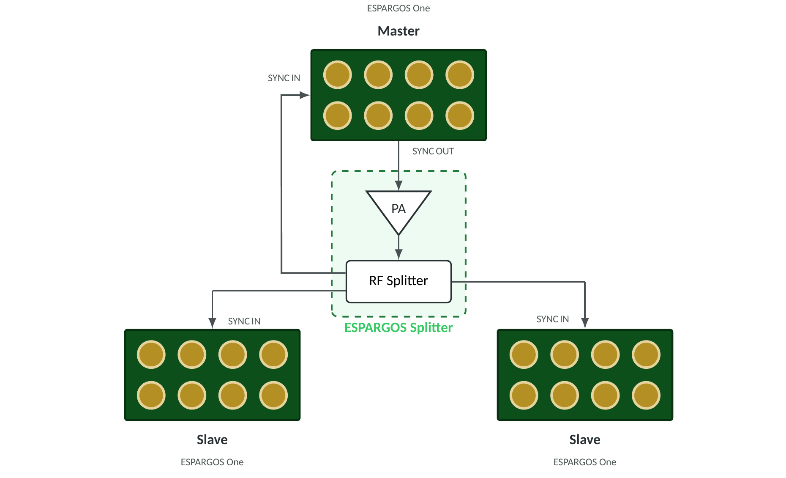
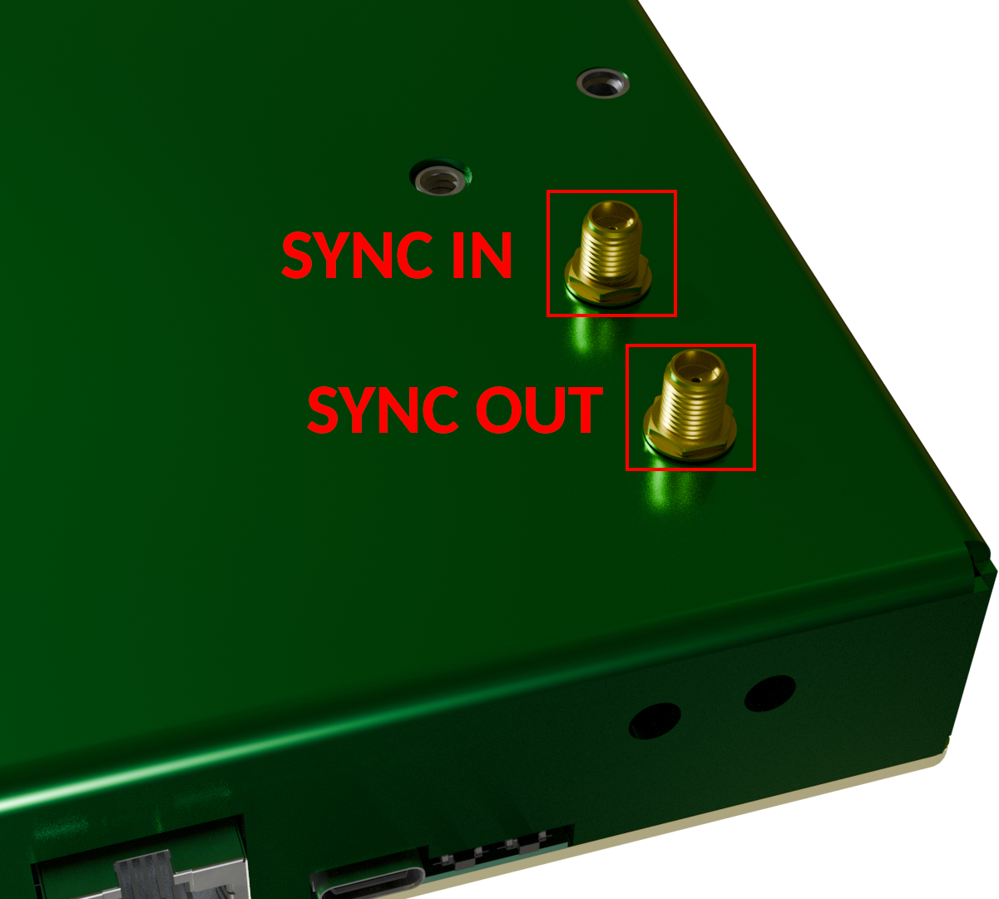
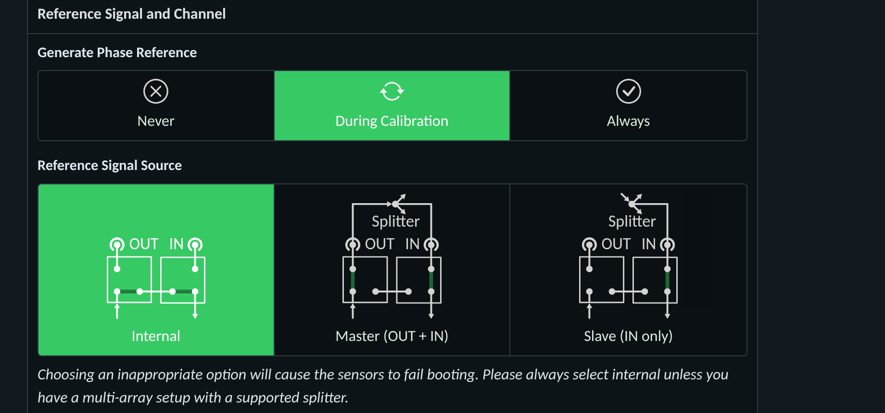

Phase-Coherent Multi-Array Systems
==================================

By default, each ESPARGOS device with its 2 × 4 antennas is phase-coherent only *within itself*: the eight antennas of one array share a common reference, but separate arrays each use their own internal reference and are therefore *not* mutually phase-coherent.
You can, however, make multiple ESPARGOS devices phase-coherent with each other by driving them all from the same reference signal.
This is an advanced feature intended for research use only.

A phase-coherent system built from several ESPARGOS devices can be arranged in two ways:

* **One large-aperture array** — the devices are mounted close together to synthesize a single, larger antenna array with finer angular resolution than an individual device.
* **Multiple distributed arrays** — the devices are spread across the environment to observe it from several vantage points, while still being mutually phase-coherent.

In both cases the wiring and configuration are identical; what differs is only the physical placement of the devices.
This page describes how to wire and configure the devices for phase-coherent operation.
If you don't need phase-coherence *across* devices, there is no need to follow these instructions: individual, unsynchronized ESPARGOS arrays are the normal configuration.

.. note::
   Several independent, unsynchronized arrays are sufficient for many applications.
   Angle-of-arrival (AoA) localization relies only on the phase coherence *within* a single device and needs no synchronization between devices.
   Only time-of-arrival (ToA) localization, which compares signal timing *across* devices, requires the phase-coherent setup described here.

   Distributed star-topology setup: the master's SYNC OUT drives a power amplifier (PA) whose output feeds an RF power splitter. One splitter port returns to the master's own SYNC IN; the rest feed the slaves. For clarity, only the synchronization (SYNC) cabling is shown; the Ethernet cabling is omitted. For up to four devices, the PA and splitter can be combined into a single *ESPARGOS Splitter* unit (dashed box).

Hardware Setup
--------------
Every ESPARGOS array integrates a reference signal generator that produces the frequency-multiplexed 40 MHz clock and 2.4 GHz phase synchronization signals.
By default, each array uses its own internal reference, so only the eight antennas *within* that array are phase-synchronous, and separate boards are not mutually phase-coherent.

To make multiple ESPARGOS devices phase-coherent with each other, all devices must share the same reference signal.
Arbitrarily select one of the arrays as the **master**: it generates the shared reference for the whole system.
All other arrays act as **slaves** that lock onto this reference.
The reference signal is distributed via the **SYNC OUT** and **SYNC IN** SMA ports on the side panel of each device.

   The two SMA reference-signal ports, **SYNC IN** and **SYNC OUT**, on the side panel of each ESPARGOS device.

Wire the devices in a **star topology** (see schematic above):

* The **master** generates the shared reference (40 MHz clock + 2.4 GHz phase, with DC bias) and outputs it on its **SYNC OUT** port.
  Crucially, the master must also receive the reference back on its own **SYNC IN** port, so that it locks onto the same distributed signal as its slaves.
* Each **slave** receives the reference on its **SYNC IN** port only.
* Because the master must also receive the reference back, the SYNC OUT signal is **always** routed through an RF power splitter, with one output port per node, *including the master itself*.
* **All cables from the splitter outputs to the devices must be identical in length and type.**
  Any difference in electrical length introduces a fixed phase offset between the devices.
  (Alternatively, see the *cable_lengths* parameter below to compensate for known length differences in software.)

Choosing a splitter and amplifier
^^^^^^^^^^^^^^^^^^^^^^^^^^^^^^^^^^
The RF power splitter must be sufficiently wideband to pass both the 40 MHz clock signal and the 2.4 GHz phase reference signal cleanly, without significant attenuation, distortion, or phase imbalance between its output ports.

* **For two arrays (one master and one slave):** a simple, low-cost resistive RF splitter is sufficient.
  No power amplifier is needed; the master's SYNC OUT provides enough signal amplitude for the calibration signal.
* **For more than two arrays:** insert a **wide-band RF power amplifier** between the master's SYNC OUT and the splitter to offset the splitter's insertion loss.
  Both the amplifier and the splitter must operate across the full required range, i.e., they must amplify and split both the 40 MHz clock signal and the 2.4 GHz phase reference signal.
  A **resistive splitter** is recommended, as resistive splitters are inherently wideband.

In any case, make sure that the signal power at the SYNC IN of each ESPARGOS device is sufficient for stable operation.
The power of the clock signal is the most critical; the phase reference signal is less critical.

.. note::
   For up to four devices (one master and up to three slaves), an *ESPARGOS Splitter* — a single unit combining the power amplifier and the RF power splitter — is available from the manufacturer upon request.

.. note::
   If your phase measurements appear noisy or unstable, this may be caused by the amplitude of the clock signal being too low.
   Make sure to choose a suitable power amplifier to boost the clock signal to the desired level.
   A voltage level of 1 Vpp at the SYNC IN of each ESPARGOS is definitely sufficient.
   Make sure not to exceed 3.3 Vpp.

.. warning::
   A device configured as master actively drives **SYNC OUT** with strong 40 MHz and 2.4 GHz signals.
   An open, unterminated, or poorly shielded SYNC OUT can radiate the 2.4 GHz signal like an antenna, which may interfere with other equipment or violate local regulations.
   Never run a master with SYNC OUT left open: always route it through shielded SMA cabling into a splitter, or terminate the port.

Software Setup
--------------
Once the devices are wired, select each device's role on the **Settings** page of its web interface, in the **Reference Signal and Channel** card.

   The **Reference Signal and Channel** settings card: per-unit selection of the reference signal source (Internal / Master / Slave) and of when the phase reference is generated.

Two settings govern the phase-coherent multi-array behavior:

* **Reference Signal Source** selects how the device obtains the reference:

  * *Internal*: standalone single array (default). The device uses its own internal generator; the SYNC ports are unused.
  * *Master (OUT + IN)*: the device generates the shared reference and drives SYNC OUT, and also locks onto the distributed signal via its own SYNC IN.
  * *Slave (IN only)*: the device locks onto an external reference received on SYNC IN.

* **Generate Phase Reference** sets when the reference packets are emitted:

  * *During calibration*: emitted only while the sensors measure the reference channel. Use this for *Internal* and *Master* devices.
  * *Never*: the device never emits the reference. Use this for *Slave* devices, which receive it from the master.
  * *Always*: continuous emission, intended for debugging only.

For a phase-coherent system, configure:

* **The master device**: *Reference Signal Source* = *Master (OUT + IN)* and *Generate Phase Reference* = *During calibration*.
* **All slave devices**: *Reference Signal Source* = *Slave (IN only)* and *Generate Phase Reference* = *Never*.

This way, the master generates the phase reference signal for the whole system during calibration, and the slaves never generate a reference signal of their own, so there is no danger of RF leakage at a non-terminated output.

.. warning::
   Selecting a *Reference Signal Source* that does not match the physical wiring (e.g., *Slave* with no signal present on SYNC IN) will cause the sensors to fail to boot.
   Leave the setting at *Internal* unless the device is part of a properly wired phase-coherent setup.

.. note::
   Switching to calibration mode (e.g., by running :code:`Pool.calibrate` or in the web interface) on any slave device will now only show phase reference packets if the master is also in calibration mode.

To obtain phase-coherent CSI data from the combined arrays, you can use the following code snippet:

.. code-block:: python

  import espargos
  import time

  pool = espargos.Pool([
   espargos.Board("192.168.1.2"),
   espargos.Board("192.168.1.3"),
   espargos.Board("192.168.1.4"),
   espargos.Board("192.168.1.5")
  ])
  pool.start()
  pool.calibrate(
   duration = 2,
   per_board = False,
   cable_lengths = [0.4, 0.4, 0.8, 0.8],
   cable_velocity_factors = [0.76, 0.76, 0.76, 0.76]
  )
  backlog = espargos.CSIBacklog(pool, size = 20)
  backlog.start()

  # Wait for a while to collect some WiFi packets to the backlog...
  time.sleep(4)

  print("Received CSI of shape: ", backlog.get_ht40().shape)

  backlog.stop()
  pool.stop()

In this example, we create a pool of four ESPARGOS boards by passing a list of four :class:`.Board` instances to the :class:`.Pool` constructor.
The important change is to call the :meth:`.Pool.calibrate` method with the *per_board* parameter set to *False*, which means that the phase calibration is performed globally across all arrays and not per-board.
This requires all ESPARGOS devices to be connected to the same phase reference signal generator (the master) so that all sensors receive the same phase reference signal packets.

The optional *cable_lengths* and *cable_velocity_factors* parameters are used to compensate for potentially different cable lengths between the splitter and the ESPARGOS devices.
If your cables are all the same length, you can omit these parameters.
If your cables are different lengths, you should measure / calculate the total cable length between the splitter and each ESPARGOS device and provide these values in the *cable_lengths* list.
You can usually look up the velocity factor in the datasheet of the coaxial cable.
